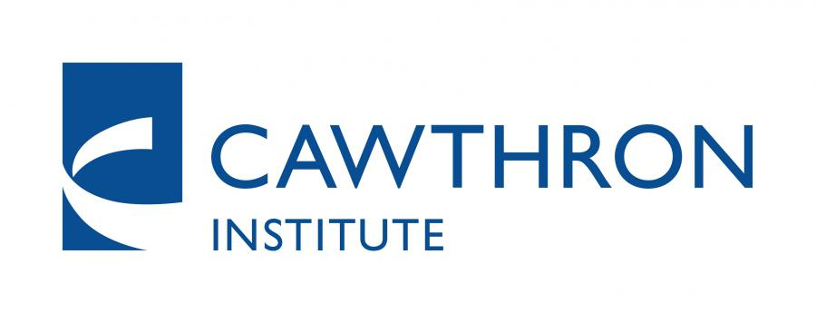

.. OceanTracker documentation master file, created by
   sphinx-quickstart on Mon Jul 11 09:12:43 2022.
   You can adapt this file completely to your liking, but it should at least
   contain the root `toctree` directive.

.. _home:

#########################
*OceanTracker*
#########################

****************************************************
Fast particle tracking in unstructured grids
****************************************************

.. raw:: html

  

    <video width="70%" controls autoplay loop>
   <source src="./_static/demos/demo02_animation.mp4">
   </video>
  

OceanTracker is a fast extendable code for offline particle tracking in unstructured grids [1]_, which also works with regular grid hydrodynamic models.
It is primarly designed for use in coastal oceans and estuaries, where unstructured grids are commonly used to efficiently represent complex coastlines and bathymetry.

OceanTracker was developed to offer a computationally faster alternative to the existing models and is currently the fastest model for unstructured grids available [2]_.
This enables users to simulate the millions of particles required for many applications on modest office computers while.
For larger applications, OceanTracker offers on-the-fly statistics to eliminate the need to store and wade through the analysis of vast volumes of recorded particle tracks to create e.g. heat-maps or reginal connectivities.

OceanTracker code is highly flexible and extendable by the user, whether run by a new user with a text file of parameters,
or by an expert adding their specialised code for novel particle behaviours or statistics, to the computational pipe line.

Its source code is publically available on `github <https://github.com/oceantracker/oceantracker/>`_ , released under the MIT licence.
OceanTracker is under active developement. Feel free to reach out to report issues or to suggest new features.

.. toctree::
   :maxdepth: 2
   :hidden:
   :caption: Contents:

   info/about.rst
   info/features.rst
   info/gallery.rst
   info/installing.rst

.. warning::

   OceanTracker is currently in beta release and its API may change in future releases (see :ref:`change_log` for breaking changes)
   If you find bugs, have suggestions or ideas make contact!

.. [1] Vennell, R., Scheel, M., Weppe, S., Knight, B. and Smeaton, M., 2021. `Fast lagrangian particle tracking in unstructured ocean model grids <https://link.springer.com/article/10.1007/s10236-020-01436-7/>`_ ,  Ocean Dynamics, 71(4), pp.423-437.
.. [2] Vennell, R., Steidle, L., Smeaton, M., Chaput, R., and Knight, B., 2025. `OceanTracker 0.5: Fast Adaptable Lagrangian Particle Tracking in Structured and Unstructured Grids <https://eartharxiv.org/repository/view/8387/>`_ 

.. |date| date::

*Last updated:* |date|

